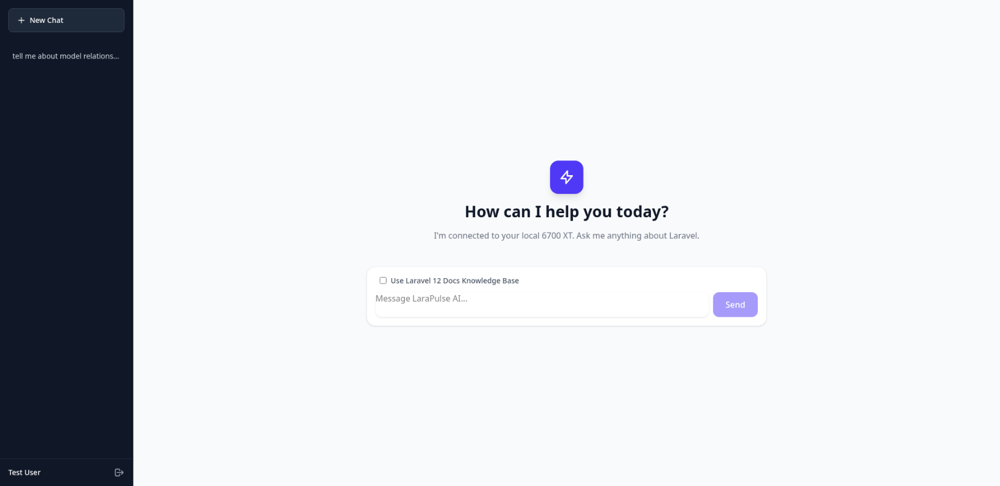
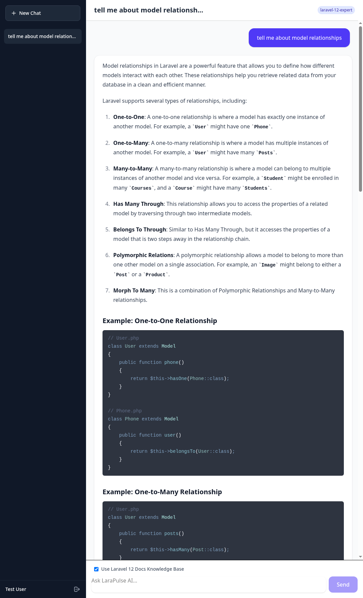

<h1 align="center">Laravel AI Assistant 🧠⚡</h1>

<p align="center">
  <strong>A modern, asynchronous AI chat interface bridging a Vue 3 frontend with a locally hosted LLM via Laravel queues.</strong>
</p>

<p align="center">
  
  
  
  
</p>

## 🚀 Overview

A bespoke Single Page Application (SPA) built to mimic the ChatGPT experience, but wired directly into a local, self-hosted Large Language Model (running on an AMD RX 6700 XT). 

Unlike standard synchronous API calls that block the PHP worker and cause browser timeouts, this application uses an **event-driven, asynchronous queueing architecture**.

<p align="center">
  
  &nbsp;
  
</p>

### ✨ Key Features

* **Optimistic UI Updates:** Instant user feedback in the DOM before the server even responds.
* **Asynchronous Polling:** The Vue frontend recursively polls a lightweight status endpoint while the heavy GPU processing happens in a Laravel background job.
* **Smart Markdown Engine:** Real-time markdown rendering using `markdown-it` and `shiki` (v1.0+) with dynamic language chunking to keep the initial JS bundle tiny.
* **RAG Context Toggling:** Users can selectively append Laravel 12 documentation to their prompts, with the UI remembering their preference per conversation.
* **Bulletproof Codebase:** Analyzed with PHPStan at **Level Max (9)**, ensuring strict types, zero unhandled nulls, and highly predictable logic.

## 🛠️ Tech Stack

* **Backend:** Laravel 12, PHP 8.3+, Valkey (Redis alternative for Queues), SQLite/MySQL
* **Frontend:** Vue 3 (Composition API / TypeScript), Inertia.js, Tailwind CSS v4
* **AI Integration:** Open WebUI / Ollama API
* **Testing & Quality:** Pest PHP (TDD), PHPStan (Level Max)

## 🚦 Getting Started

### Prerequisites
* Docker Desktop (for Laravel Sail)
* Node.js & NPM
* A local instance of Ollama/Open WebUI running an LLM (e.g., `llama3` or `laravel-expert`).

### Installation

1. **Clone the repository:**
   ```bash
   git clone [https://github.com/samrook/demo-ai-assistant.git](https://github.com/samrook/demo-ai-assistant.git)
   cd demo-ai-assistant
   ```

2. **Install PHP dependencies:**
    ```bash
    docker run --rm \
        -u "$(id -u):$(id -g)" \
        -v "$(pwd):/var/www/html" \
        -w /var/www/html \
        laravelsail/php84-composer:latest \
        composer install --ignore-platform-reqs
    ```

3. **Configure the environment:**
    ```bash
    cp .env.example .env
    ```
    *Make sure to update OPEN_WEBUI_URL and OPEN_WEBUI_API_KEY in your .env to point to your local AI instance.*

4. **Start the Sail containers:**
    ```bash
    ./vendor/bin/sail up -d
    ./vendor/bin/sail artisan key:generate
    ./vendor/bin/sail artisan migrate:fresh --seed
    ```

5. **Install frontend assets:**
    ```bash
    ./vendor/bin/sail npm install
    ./vendor/bin/sail npm run dev
    ```

6. **Start the Queue Worker (Crucial):**
    *Because AI generation is heavy, it runs in the background. You must start the queue worker to process messages.*
    ```bash
    ./vendor/bin/sail artisan queue:work
    ```

7. **Visit the app:** Open `http://localhost` and log in with the seeded test user (`test@example.com` / `password`).

## 🧪 Testing & Code Quality

The application was built using strict Test-Driven Development.

**Run the test suite:**

```bash
./vendor/bin/sail artisan test
```

**Run Static Analysis (Level Max):**

```bash
./vendor/bin/sail vendor/bin/phpstan analyse
```
